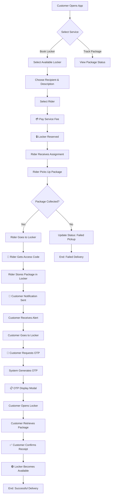
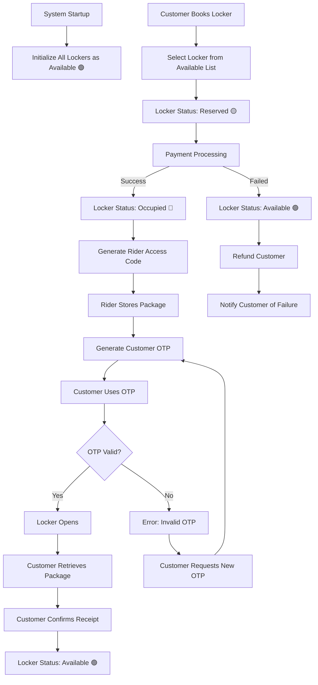
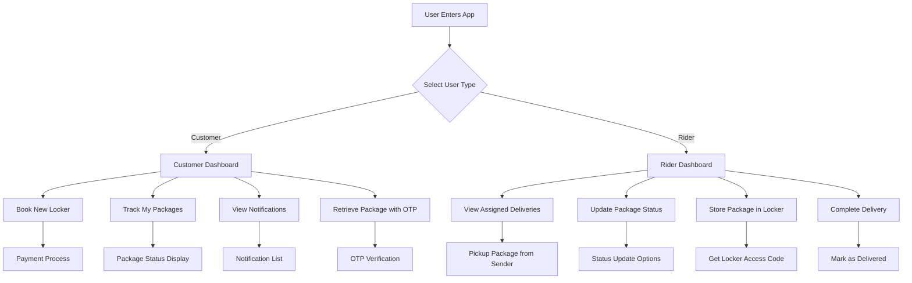
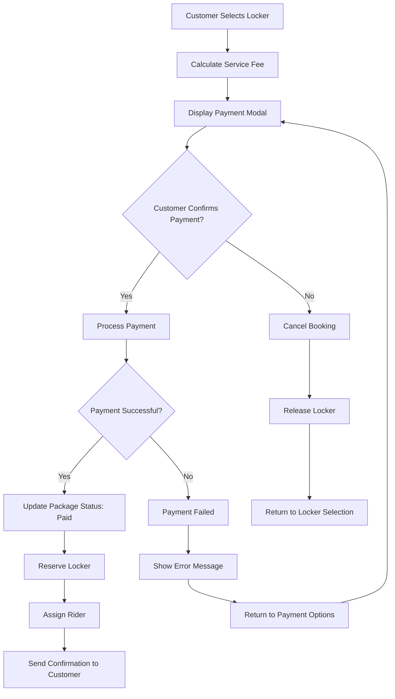
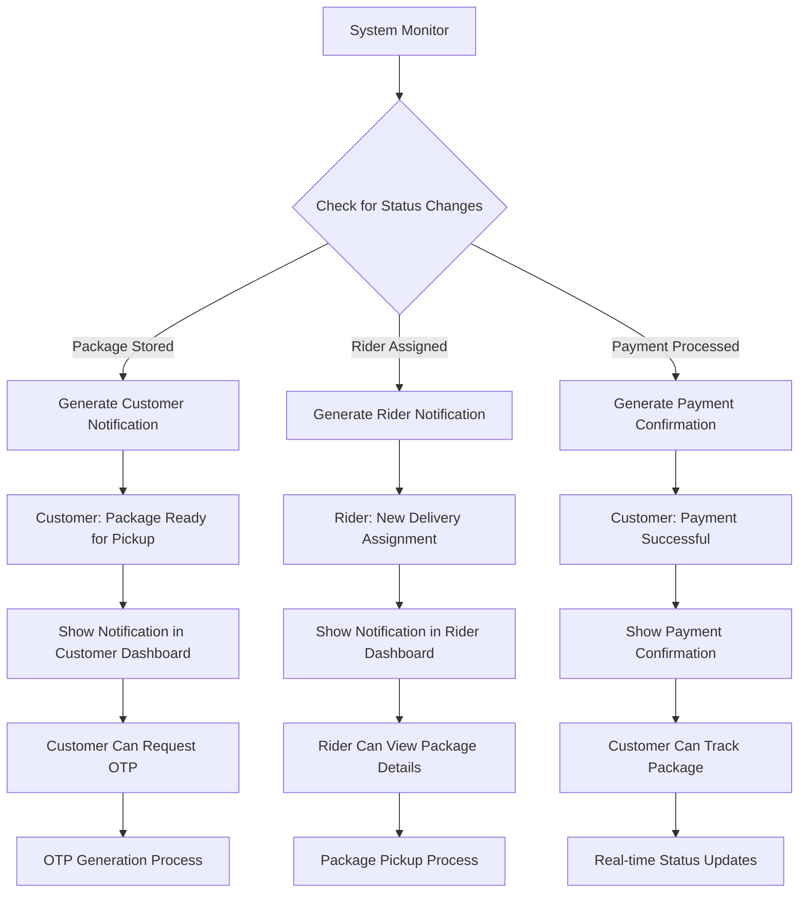
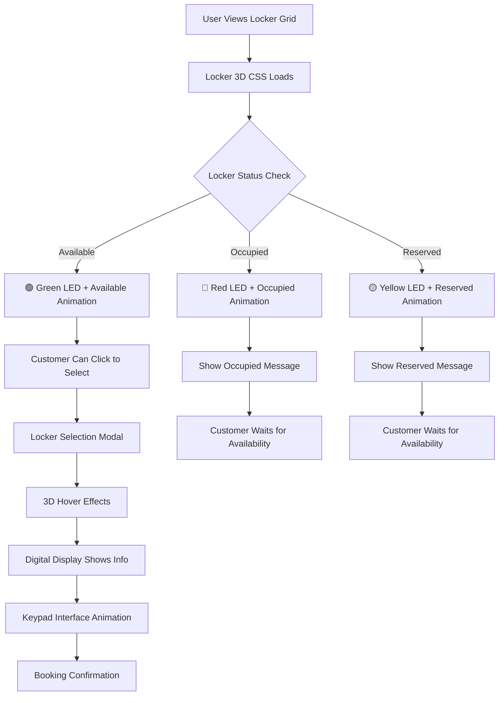

# 📊 Smart Delivery App - System Flowcharts

## 🎯 Main Workflow Flowchart

## 🔐 Locker Management Flowchart

## 👥 User Role Flowchart

## 🔄 Payment Flow

## 📱 Notification System Flow

## 🎨 3D Locker Interaction Flow

